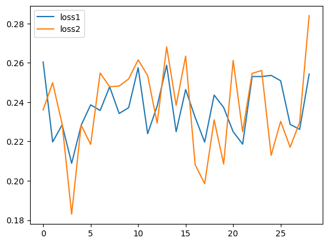
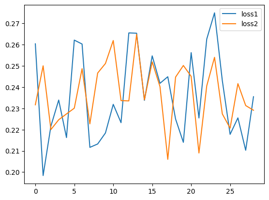
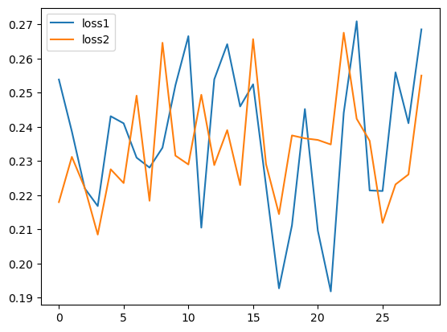

## softprompt zo-Adam grid search result (1 epoch)

- baseline:
    - train_loss:0.23392285406589508
    - train_accuracy:0.4260506331920624
    - test_loss:0.29128023982048035
    - test_acc:0.3018292486667633
- learning_rate=1e-05, variation_scale=0.1:
    - train_loss:0.2401987463235855
    - train_accuracy:0.4212014973163605
    - test_loss:0.28256022930145264
    - test_acc:0.3132621943950653
    - training_curve:
- learning_rate=1e-05, variation_scale=0.01:
    - train_loss:0.2411266714334488
    - train_accuracy:0.41945043206214905
    - test_loss:0.28711965680122375
    - test_acc:0.29649388790130615
    - training_curve:
- learning_rate=1e-05, variation_scale=0.001:
    - train_loss:0.23280642926692963
    - train_accuracy:0.42416489124298096
    - test_loss:0.2818285822868347
    - test_acc:0.30564025044441223
    - training_curve:
- learning_rate=1e-06, variation_scale=0.1:
    - train_loss:0.23667888343334198
    - train_accuracy:0.43305495381355286
    - test_loss:0.2896467447280884
    - test_acc:0.291158527135849
    - training_curve:
- learning_rate=1e-06, variation_scale=0.01:
    - train_loss:0.2403506636619568
    - train_accuracy:0.4240301847457886
    - test_loss:0.28388768434524536
    - test_acc:0.3147865831851959
    - training_curve:
- learning_rate=1e-06, variation_scale=0.001:
    - train_loss:0.24416998028755188
    - train_accuracy:0.41931572556495667
    - test_loss:0.2891397774219513
    - test_acc:0.32698169350624084
    - training_curve:
- learning_rate=1e-07, variation_scale=0.1:
    - train_loss:0.24101512134075165
    - train_accuracy:0.4170258641242981
    - test_loss:0.2920945882797241
    - test_acc:0.3185975253582001
    - training_curve:
- learning_rate=1e-07, variation_scale=0.01:
    - train_loss:0.23846426606178284
    - train_accuracy:0.4237607717514038
    - test_loss:0.29296863079071045
    - test_acc:0.31707319617271423
    - training_curve:
- learning_rate=1e-07, variation_scale=0.001:
    - train_loss:0.24343854188919067
    - train_accuracy:0.41918104887008667
    - test_loss:0.2916679084300995
    - test_acc:0.3102134168148041
    - training_curve:
<!-- table for comparing -->
| learning_rate | variation_scale | train_loss | train_accuracy | test_loss | test_acc |
|---------------|-----------------|------------|----------------|-----------|----------|
| Baseline | Baseline | 0.23392285406589508 | 0.4260506331920624 | 0.29128023982048035 | 0.3018292486667633 |
| 1e-05         | 0.1             | 0.2401987463235855 | 0.4212014973163605 | 0.28256022930145264 | 0.3132621943950653 |
| 1e-05         | 0.01            | 0.2411266714334488 | 0.41945043206214905 | 0.28711965680122375 | 0.29649388790130615 |
| 1e-05         | 0.001           | 0.23280642926692963 | 0.42416489124298096 | 0.2818285822868347 | 0.30564025044441223 |
| 1e-06         | 0.1             | 0.23667888343334198 | 0.43305495381355286 | 0.2896467447280884 | 0.291158527135849 |
| 1e-06         | 0.01            | 0.2403506636619568 | 0.4240301847457886 | 0.28388768434524536 | 0.3147865831851959 |
| 1e-06         | 0.001           | 0.24416998028755188 | 0.41931572556495667 | 0.2891397774219513 | 0.32698169350624084 |
| 1e-07         | 0.1             | 0.24101512134075165 | 0.4170258641242981 | 0.2920945882797241 | 0.3185975253582001 |
| 1e-07         | 0.01            | 0.23846426606178284 | 0.4237607717514038 | 0.29296863079071045 | 0.31707319617271423 |
| 1e-07         | 0.001           | 0.24343854188919067 | 0.41918104887008667 | 0.2916679084300995 | 0.3102134168148041 |
<!-- end of table -->

## softprompt msgd 1 epoch
- learning_rate=1e-05, variation_scale=0.001, momentum=0.9, weight_decay=0.1:
    - train_loss:0.5618733167648315
    - train_accuracy:0.10115841031074524
    - test_loss:0.552913248538971
    - test_acc:0.08917682617902756
    - training_curve:
- learning_rate=1e-05, variation_scale=0.001, momentum=0.9, weight_decay=0.01:
    - train_loss:0.474616676568985
    - train_accuracy:0.20352908968925476
    - test_loss:0.47899550199508667
    - test_acc:0.15625
    - training_curve:
- learning_rate=1e-06, variation_scale=0.001, momentum=0.9, weight_decay=0.1:
    - train_loss:0.2402656376361847
    - train_accuracy:0.4210668206214905
    - test_loss:0.2931646704673767
    - test_acc:0.3216463327407837
    - training_curve:
- learning_rate=1e-06, variation_scale=0.001, momentum=0.9, weight_decay=0.01:
    - train_loss:0.23759816586971283
    - train_accuracy:0.4229525625705719
    - test_loss:0.2886367440223694
    - test_acc:0.31859755516052246
    - training_curve:

<!-- table for comparing -->
| learning_rate | weight_decay | train_loss | train_accuracy | test_loss | test_acc |
|---------------|-----------------|------------|----------------|-----------|----------|
| Baseline | Baseline | 0.23392285406589508 | 0.4260506331920624 | 0.29128023982048035 | 0.3018292486667633 |
| 1e-05         | 0.1             | 0.5618733167648315 | 0.10115841031074524 | 0.552913248538971 | 0.08917682617902756 |
| 1e-05         | 0.01            | 0.474616676568985 | 0.20352908968925476 | 0.47899550199508667 | 0.15625 |
| 1e-06         | 0.1             | 0.2402656376361847 | 0.4210668206214905 | 0.2931646704673767 | 0.3216463327407837 |
| 1e-06         | 0.01            | 0.23759816586971283 | 0.4229525625705719 | 0.2886367440223694 | 0.31859755516052246 |

## softprompt msgd 3 epoch
- learning_rate=1e-06, variation_scale=0.001, momentum=0.95, weight_decay=0.01:
    - train_loss:0.23573683202266693
    - train_accuracy:0.4276670515537262
    - test_loss:0.2887967824935913
    - test_acc:0.3094511926174164
    - training_curve:

## softprompt msgd with 7×7 projection 1 epoch
- learning_rate=1e-03, variation_scale=0.001, momentum=0.9, weight_decay=0.01:
    - train_loss:0.696190357208252
    - train_accuracy:0.04552801698446274
    - test_loss:0.6795473694801331
    - test_acc:0.049542684108018875
    - training_curve:
- learning_rate=1e-04, variation_scale=0.001, momentum=0.9, weight_decay=0.01:
    - train_loss:0.24037480354309082
    - train_accuracy:0.4199892282485962
    - test_loss:0.27568334341049194
    - test_acc:0.30716460943222046
    - training_curve:
- learning_rate=1e-05, variation_scale=0.001, momentum=0.9, weight_decay=0.01:
    - train_loss:0.23664037883281708
    - train_accuracy:0.42227911949157715
    - test_loss:0.2762233316898346
    - test_acc:0.30716460943222046
    - training_curve:
- learning_rate=1e-06, variation_scale=0.001, momentum=0.9, weight_decay=0.01:
    - train_loss:0.23575358092784882
    - train_accuracy:0.4269935190677643
    - test_loss:0.2863886058330536
    - test_acc:0.30792680382728577
    - training_curve:

<!-- table -->
| learning_rate | weight_decay | train_loss | train_accuracy | test_loss | test_acc |
|---------------|-----------------|------------|----------------|-----------|----------|
| Baseline | Baseline | 0.23392285406589508 | 0.4260506331920624 | 0.29128023982048035 | 0.3018292486667633 |
| 1e-03         | 0.01            | 0.696190357208252 | 0.04552801698446274 | 0.6795473694801331 | 0.049542684108018875 |
| 1e-04         | 0.01            | 0.24037480354309082 | 0.4199892282485962 | 0.27568334341049194 | 0.30716460943222046 |
| 1e-05         | 0.01            | 0.23664037883281708 | 0.42227911949157715 | 0.2762233316898346 | 0.30716460943222046 |
| 1e-06         | 0.01            | 0.23575358092784882 | 0.4269935190677643 | 0.2863886058330536 | 0.30792680382728577 |

## softprompt msgd with greedy decoding 1 epoch (test with sampling)
- learning_rate=1e-05, variation_scale=0.001, momentum=0.9, weight_decay=0.01:
    - train_loss:0.24069197475910187
    - train_accuracy:0.4182381331920624
    - test_loss:0.2752178907394409
    - test_acc:0.3033536672592163
    - training_curve:
- learning_rate=1e-06, variation_scale=0.001, momentum=0.9, weight_decay=0.01:
    - train_loss:0.23907123506069183
    - train_accuracy:0.4198545217514038
    - test_loss:0.2916501462459564
    - test_acc:0.3010670840740204
    - training_curve:

<!-- table -->
| learning_rate | weight_decay | train_loss | train_accuracy | test_loss | test_acc |
|---------------|-----------------|------------|----------------|-----------|----------|
| Baseline | Baseline | 0.23392285406589508 | 0.4260506331920624 | 0.29128023982048035 | 0.3018292486667633 |
| 1e-05         | 0.01            | 0.24069197475910187 | 0.4182381331920624 | 0.2752178907394409 | 0.3033536672592163 |
| 1e-06         | 0.01            | 0.23907123506069183 | 0.4198545217514038 | 0.2916501462459564 | 0.3010670840740204 |